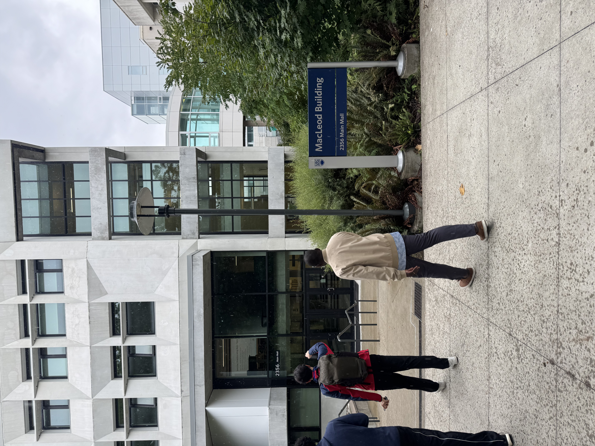

MDS orientation spanned across three days, during which we were introduced to the program, faculty, and our new learning environment. One of the most exciting parts of orientation was the GooseChase activity that took place on the final day. We explored the UBC campus, visited different buildings, and got to see our classrooms. This experience helped me become more familiar with the campus and made me feel more comfortable and connected to the MDS community. It was a great way to start this new journey and, most importantly, made me feel like I truly belonged!

In the first week of classes, everything happened very quickly. Because of the intensity of the program, it felt like I had already been part of the program for much longer than just one week. I made sure to become familiar and comfortable with the different tools and platforms we use for our courses. Once our classes and labs began, I focused on completing my assignments early so that I could meet the submission deadlines by the end of the week.

Although the first week of the MDS program was overwhelming, it quickly pushed me into “fight mode” and motivated me to challenge myself. I learned to manage my time effectively, stay organized, and prioritize my responsibilities so that I could accomplish all of my tasks on time.